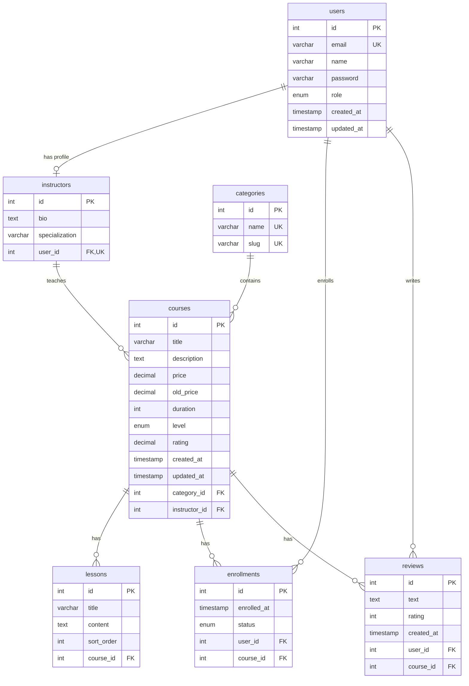

# test

```mermaid
erDiagram
    users {
        int id PK
        varchar email UK
        varchar name
        varchar password
        enum role
        timestamp created_at
        timestamp updated_at
    }

    instructors {
        int id PK
        text bio
        varchar specialization
        int user_id FK,UK
    }

    categories {
        int id PK
        varchar name UK
        varchar slug UK
    }

    courses {
        int id PK
        varchar title
        text description
        decimal price
        decimal old_price
        int duration
        enum level
        decimal rating
        timestamp created_at
        timestamp updated_at
        int category_id FK
        int instructor_id FK
    }

    lessons {
        int id PK
        varchar title
        text content
        int sort_order
        int course_id FK
    }

    enrollments {
        int id PK
        timestamp enrolled_at
        enum status
        int user_id FK
        int course_id FK
    }

    reviews {
        int id PK
        text text
        int rating
        timestamp created_at
        int user_id FK
        int course_id FK
    }

    users ||--o| instructors : "has profile"
    users ||--o{ enrollments : "enrolls"
    users ||--o{ reviews : "writes"
    instructors ||--o{ courses : "teaches"
    categories ||--o{ courses : "contains"
    courses ||--o{ lessons : "has"
    courses ||--o{ enrollments : "has"
    courses ||--o{ reviews : "has"
```
